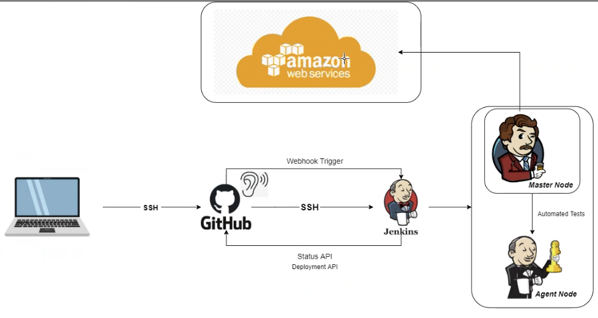
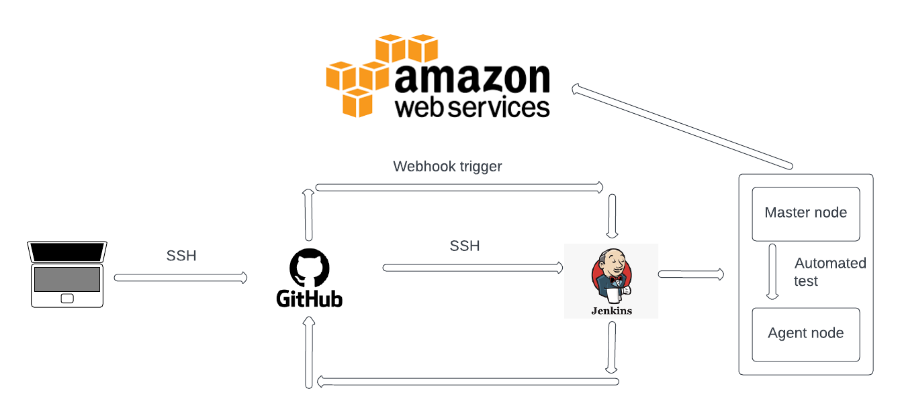
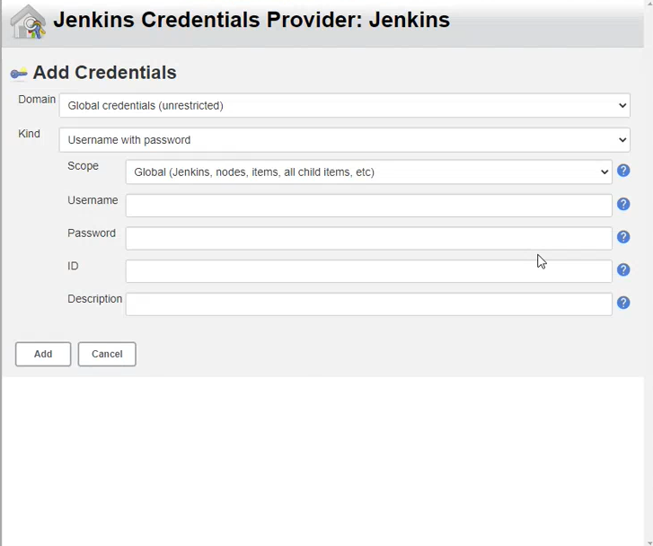
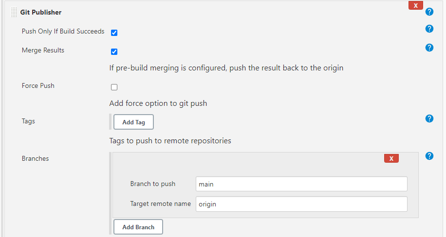
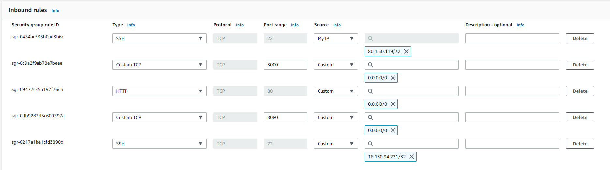
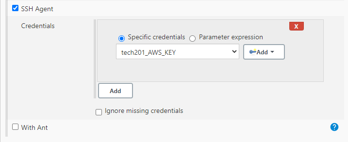
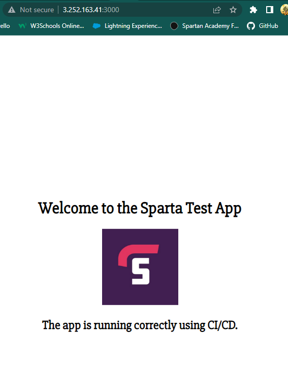

# CI-CD-CDE with Jenkins

## CI (Continuous Integration)


Continuous Integration is a practice of automating the integration of code changes from multiple contributors into a single software project(implementing small segmets into the code).

It is a primary DevOps practice, allowing developers to frequently merge code changes into a central repository where builds and tests then run.

**Automated tools**  are used to assert the new code's correctness before integration. 

### Importance of CI

In order to understand the importance of CI, it is helpful to first discuss some ain points that often arise due to the absence of CI. Without CI, developers must manually coordinate and communicate when they are contributing code to the end product. This coordination extends beyond the development teams to operations and the rest of the organization.

Product teams must coordinate when to sequentially launch features and fixes and which team members will be responsible. 

## CD (Continuous Delivery)

Continuous delivery is an approach where teams release quality products frequently and predictably from source code repository to production in an automated fashion. 

### How does it work ? 

A continuous delivery pipeline could have a manual gate right before production. A manual gate requires a human intervention, and there could be scenarios in your organization that require manual gates in pipelines. 

The engineering team keeps a shippable version of the product ready after every sprint, and the business team makes the finall call to release the product to all customers, or a cross-section of the population, or perhaps to people who line in a certain geographical location. 


## CDE (Continuous deployment)

CDE goes one step further than continuous delivery. With this practice, every change that passes all stages of your production pipeline is released to your customer.

There is no human intervention, and only a failed test will prevent a new change to be deployed to production. 


Continuous deployment is an excellent way to accelerate the feedback loop with your customers and take pressure off the team as there isn't a release day anymore.

Developers can focus on building software, and they see their work go live minutes after they have finished working on it. 


---

## Jenkins


Jenkins is an open-source automation server used to build, test, and deploy software projects. Essentially enables CI and CD pipelines, allowing software developers to automate their build, test and deployment processes. 




### How does it work ?

1. A developer pushes code changes to a GitHub repository.
2. Jenkins monitors the repository for changes and detects the new code.
3. Jenkins pulls the code changes from the GitHub repository to the Jenkins master node, which is the central server that controls the Jenkins environment.
4. The Jenkins master node delegates the build and test process to one or more agent nodes, which are typically separate servers or virtual machines that run the build and test jobs in parallel.
5. The agent nodes run the build and test jobs, and report the results back to the Jenkins master node.
6. Depending on the results of the build and test jobs, Jenkins may trigger additional stages of the CI/CD process, such as deploying the code changes to a staging environment or promoting the code changes to production.

If the tests fail, the process will be marked as failed and Jenkins will alert the relevant parties about the failure. 

If this happens it means that there is a problem with the code changes that were made and further investigation is required to find the root of this issue. 

It is up to developers to review the code, identify the issue, fix the problem, and commit the fixes back to the repository. 

Once the fixes have been committed, the Jenkins pipeline will automatically trigger a new build, which will repeat the build, test and deployment processes. 

This cycle will continue until all tests are marked as passed. 


### Benefits of Jenkins

- It is open source and it is user-friendly, easy to install and does not require additional installations or components
- It is free of cost
- Easily configurable: Jenkins can be easily modified and extended. It deploys code instantly and generates test reports. 
- Platform Independent: Jenkins is available for all platforms and different operating systems.
- Easy support: Because it is open source and widely used, there is no shortage in support from large online communities of agile teams.
- Developers can write the tests to detect the errors of their code as soons as possible. 
- Issues are detected and resolved almost right away
- Most of the integration work is automated. This saves both time and money over the lifespan of the project. 


---


## Git workflow


In the diagram above we have the Git workflow. As we can see we have different stages. 

- `git add`: Adds any changes made into the staging area where the changes are ready to be commited.
- `git commit`: Commits previously added changes with descriptive message.
- `git push`: Pushes the changes to the remote repository from our local repository. With the `push` command often times we will need to specify the branch we would like to push to. 
- `git pull`: This command is used to fetch and download content from a remote repository to our local one to match that content. 
- `git checkout`: This command lets us navigate between branches created by git branch. Checking out a branch updates the files in the working directory to match the version stored in that branch and it tells Git to record all new comits on that branch. 


---

## SDLC (Software Developemnt Life Cycle)


SDLC is a methodology used to develop software in a systematic and structured manner. It consists of several stages, each with its own set of activities.


1. **Planning**: This is the first stage of SDLC, where the project's objectives and requirements are indentified. In this stage, the project team outlines the project scope, and create a project plan. The planning stage is a foundation for the entire SDLC process and sets the project.s direction.

2. **Analysis**: In this stage, the project team analyzes the requirements gathered in the planning stage. The team identifies the users needs, their goals, and the software requiremenets.
The team creates use cases, user stories, and functional specifications. The analysis stage determines the software's functionality and provides a detailed description of the software.

3. **Design**:  In the design stage, the project team creates a detailed technical design for the software. The team determines the software's architecture, the software's components, and the data schema. The team creates prototypes and mockups to give stakeholders a visual representation of the software's design.

4. **Implementation**: In this stage, the project teamm starts to code the software. The team uses the software design to create the software's source code and create the user interface.
This stage where the software starts to take shape.

5. **Testing and Integration**: Here the teams test the functionallity and performance of the software. The team conduct functional testing, integration testing, and performance testing.
Here we can identify any bugs and errors.

6. **Maintenance**: Once the software is deployed, it enters the maintenance stage. In this stage, the project team provides ongoing supports for the software.
They fix bugs and errors, implements new features, and performs software upgrades.
The maintenance stage ensures tha the software continues to meet the user's needs and stays up-to-date with changing technologies.


Overall, the SDLC is a structured and systematic approach to software development that provides a framework for managing the software development process from start to finish.


# CI(Continuous Integration) set up




We need to establish the connection between our local host and GitHub.

We need to create an RSA key on our local host in GitBash terminal in `.ssh` folder where we store all of our keys. 

- `ssh-keygen -t rsa -b 4096 -C "email_address"` and choose appropriate name for the key folder that will create a private key and public key. 

We will need to copy the public key using `cat name.pub` to display the content of the key and paste it in: **Settings** of the repo that has the app folder, **Deploy keys** and **Add key**. 


**Then we need to create a Job on Jenkins.**

Use appropriate name for this job "marek-CI".

In the description we can type "Building CI with webhook, Project URL with HTTPS, Repo URL with SSH".

Next we click on "Discard old builds"- Max: 3

**GitHub project check box:** We provide HTTPS URL from the repo with the app


**Office 365 Connector**: "Restrict where this project can be run->**Label Expression**: sparta-ubuntu-node

**Source Code Management**- Git:

- Copy the SSH URL from the same repo and paste it into the "Repository URL"

**Note** if we are getting an error "Failed to connect to repository" this happened because the GitHub and Jenkins do not know if Jenkins request is secure. To resolve this we need to go to GitHub and go to "Settings" of that specific repo and select "Deploy key"-> "Add deploy key", name it and paste in the Public key we created on our local host and "Allow write access".

We will need to enter the private key in t
**Credentials**- "Add" dropdown 



**Kind**: SSH Username with private key

We need to name it, use the same name you have for your private key and Click on "Enter Directly"->"Add" and paste the content of your private key into the box. 

Lastly "Add" and Choose the key we just used. 

**Branch specifier**: */main


**Build Triggers**: First iteration we will trigger it manually


**Build environment**: Provide Node& npm check box(We provided all the plugins needed)


**Build steps**: Execute shell

- `cd app`
- `npm install`
- `npm test`

Lastly "Apply" and "Save".

In the project we click on "Build now" and it will build a job. 

We can find the code that has been cloned into Jenkins we click in "Work space". 


If we would like it to trigger a job with webhook we will need to go to the "Configuration" and in the **Build Trigger** section we click on "GitHub hook trigger from GITScm polling".

We will need to copy the IP:port and we go to GitHub repo settings and click on "Webhooks" and "Add Webhook". 

**Payload URL**: Paste in the IP:port/github-webhook/
**Content Type**: application/json
**Which events would you like to trigger this webhook**: Just the push event
Toggle **Active**
Lastly "Add webhook".
**NOTE**:
 Everytime we turn off the Jenkins and spin it up again the IP will change. 


 Now that we added the webhook, every change made locally will be passed down to GitHub and Jenkins. 


 Now we will have to go to the Jenkins job and go into "Configuration" and in the **Build Trigger** section we click on "GitHub hook trigger from GITScm polling".

 If we would like to check the functionality we can go back to our GitBash terminal, navigate to the folder where we store our app and use `nano README.md` to make a change in the README file and save it. 

 ```
 git add .
 git commit -m "Testing CI"
 git push -u origin main
 ```

After that we can check if it has been pushed on our GitHub repository and lastly check if Jenkins has spinned up another job.


## CD(Continuous Delivery) pipeline between Jenkins and AWS EC2 instance


### Job 1

Create a `dev` branch localy using `git checkout dev`

If we push changes throught this branch and it will not display in the other branch, this means they are not merged yet. 

### Job 2

- If we would like to merge dev branch with main, we will need to start another job on Jenkins and change the "Post build actions" and select the previous job-> `marek-CI` and select `Trigger if build is stable`.

Then `Add  Git publisher`:
- `Push only if build succeeds`
- `Merge result`



Now if we "Apply" and "Save" and the tests are succesful, we should be able to see the changes made in `dev` branch displayed in the `main` branch. 

### Job 3

**Next we need to create an EC2 instance on AWS** 

We can now move onto the EC2 instance on AWS:
- We will need to use appropriate naming convention
- OS: Ubuntu 18.04
- Instance Type: t2.micro
- Key pair: devops-tech201
- VPC: default
- Subnet: Default
- Security group: Create a new
- Security rules as follows: 

### Note:

1. We need to remember to allow Jenkins on port 22 and use IP address of Jenkins from the URL bar as well as Jenkins port `8080`. 
2. As well as SSH protocol with the IP address of the EC2 instance



Lastly we create an instance. 

Next we will need to create a new item on Jenkins called "marek-job3" just like before only with there differences:

1. `Build triggers` configuration of our job-> `Build after other project are built` and choose the previous project to be watched.
2. **Build environment**:


3. Next we need to change configuration of the `SSH Agent` and input the key that was provided for this task.


3. Now we can move onto the `Execute shell` and input the appropriate commands to run the app and we can Apply and Save the changes.

**Note**:

The Execute shell window may vary case to case but the best practice is to use the `scp` command and `nohup` where scp is for copying files and nohup is to run the app on the background. 

```
rsync -avz -e "ssh -o StrictHostKeyChecking=no" app ubuntu@IP:/home/ubuntu
ssh -o "StrictHostKeyChecking=no" ubuntu@IP <<EOF
	sudo bash ./app/provsion.sh
    cd app
    pm2 kill
    pm2 start app.js
EOF
```

```
rsync -avz -e "ssh -o StrictHostKeyChecking=no" app ubuntu@3.252.163.41:/home/ubuntu
ssh -o "StrictHostKeyChecking=no" ubuntu@3.252.163.41 <<EOF
    sudo bash ./app/provsion.sh
    cd app
    npm install
    nohup npm start 2>/dev/null 1>/dev/null&
    
EOF
```

```

scp -v -r -o StrictHostKeyChecking=no app/ ubuntu@3.252.163.41:/home/ubuntu/
ssh -A -o StrictHostKeyChecking=no ubuntu@3.252.163.41 <<EOF

cd app
npm install
pm2 kill
pm2 start app.js

```

Lastly "Apply", "Save", and "Build Now". 

When the job has been successful we can open GitBash terminal, navigate into the `.ssh` folder where we keep all the keys and connect to the EC2 instance using SSH.

Next we run `npm install` that will download package and it's dependencies and `node app.js` to run the app. 


If we would like to see if the pipeline is functional, we can make a change locally in `app`->`views`->`nano index.ejs` and change the second heading.
As we can see in the picture below, I have changed the heading to "The app is running correctly using CI/CD."




