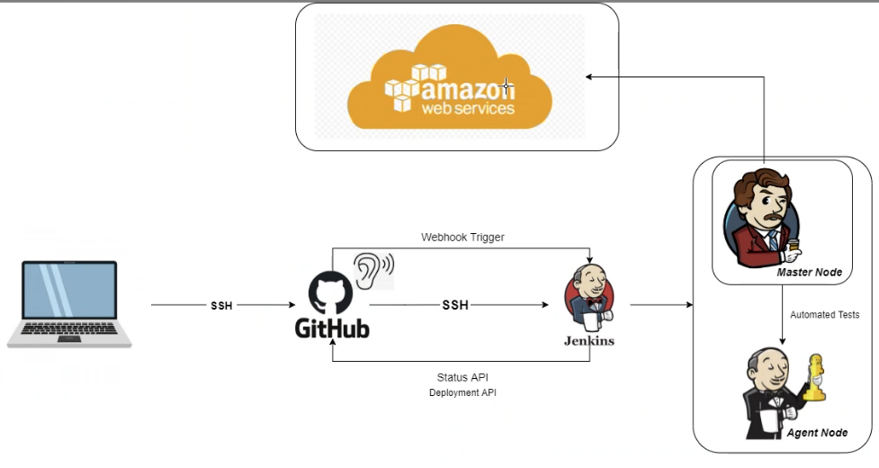

# CI-CD-CDE-Jenkins

## CI (Continuous Integration)

Continuous Integration is a practice of automating the integration of code changes from multiple contributors into a single software project.

It is a primary DevOps practice, allowing developers to frequently merge code changes into a central repository where builds and tests then run.

**Automated tools**  are used to assert the new code's correctness before integration. 

### Importance of CI

In order to understand the importance of CI, it is helpful to first discuss some ain points that often arise due to the absence of CI. Without CI, developers must manually coordinate and communicate when they are contributing code to the end product. This coordination extends beyond the development teams to operations and the rest of the organization.

Product teams must coordinate when to sequentially launch features and fixes and which team members will be responsible. 

## CD (Continuous Delivery)

Continuous delivery is an approach where teams release quality products frequently and predictably from source code repository to production in an automated fashion. 

### How does it work ? 

A continuous delivery pipeline could have a manual gate right before production. A manual gate requires a human intervention, and there could be scenarios in your organization that require manual gates in pipelines. 

The engineering team keeps a shippable version of the product ready after every sprint, and the business team makes the finall call to release the product to all customers, or a cross-section of the population, or perhaps to people who line in a certain geographical location. 

## CDE (Continuous deployment)

CDE goes one step further than continuous delivery. With this practice, every change that passes all stages of your production pipeline is released to your customer.

There is no human intervention, and only a failed test will prevent a new change to be deployed to production. 

Continuous deployment is an excellent way to accelerate the feedback loop with your customers and take pressure off the team as there isn't a release day anymore.

Developers can focus on building software, and they see their work go live minutes after they have finished working on it. 

---

## Jenkins

Jenkins is an open-source automation server used to build, test, and deploy software projects. Essentially enables CI and CD pipelines, allowing software developers to automate their build, test and deployment processes. 

### How does it work ?

Jenkins works by pulling code changes from a source code repository and triggering a build process. The build process involves compiling the code, running unit tests, and producting executable files or packages. 
If the build process is succesful, the build is then deployed to a testing environment, where furher tests can be run. If all the tests pass, the build is then automatically deployed to the production environment. 

If the tests fail, the process will be marked as failed and Jenkins will alert the relevant parties about the failure. 

If this happens it means that there is a problem with the code changes that were made and further investigation is required to find the root of this issue. 

It is up to developers to review the code, identify the issue, fix the problem, and commit the fixes back to the repository. 

Once the fixes have been committed, the Jenkins pipeline will automatically trigger a new build, which will repeat the build, test and deployment processes. 

This cycle will continue until all tests are marked as passed. 